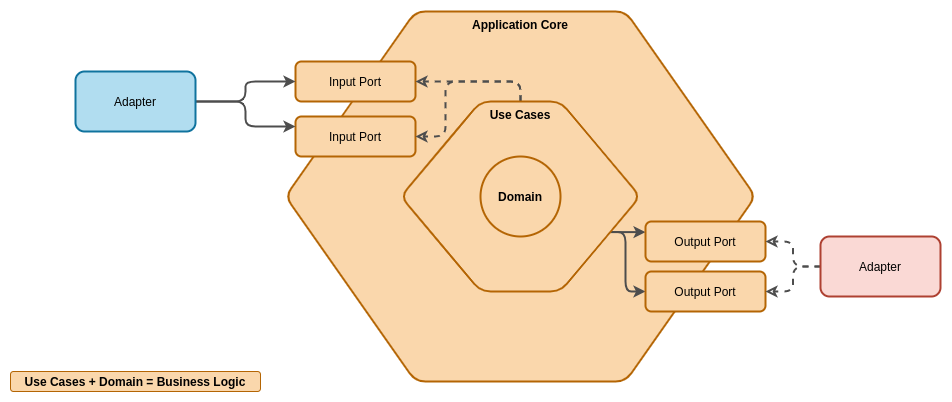

# tenpo-challenge

#Configuration Properties

Para la carga de configuraciones, y para evitar el uso del @value de spring y de esta manera centralizar las properties se utilizan clases para el mapeo de las properties mediante una configuracion llamada @ConfigurationProperties(prefix = "")
De esta manera podemos tener las properties mapeadas en un objeto que puede injectarse en cualquier componente y ser utilizado para leer alguna propertie en particular
para ver como funciona [aca](https://www.baeldung.com/configuration-properties-in-spring-boot) hay una guia de implementacion
En esta semilla existe una clase SpringConfigurationProperties donde se configuran las properties del spring

## Estructura
Para este proyecto se esta usando una interpretacion de la arquitectura Hexagonal, tambien conocida como Ports and Adapters. El enfoque que decidimos tomar es bastante similar a lo que se plantea en [este articulo](https://reflectoring.io/spring-hexagonal/)

### Ejemplo

